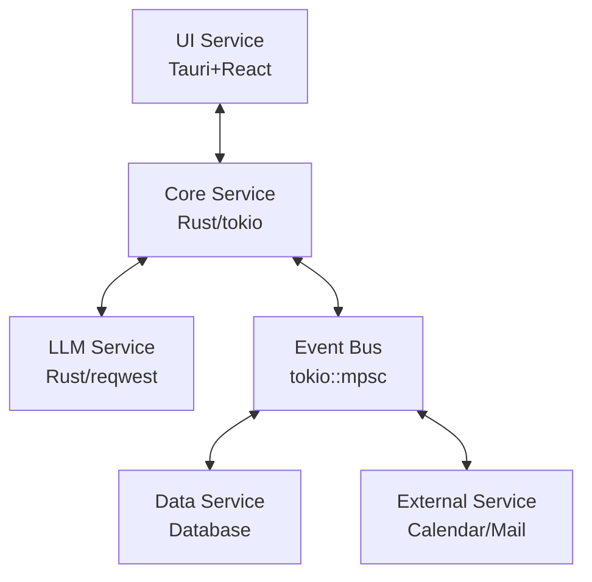

# AI Manager

LLMの高度な推論能力を活用して、スケジュール管理や事務処理、単純な反復操作の自動化を支援するバックグラウンド常駐アプリケーション。

## 🚀 概要

AI Managerは、日常的なタスクを効率化するためのインテリジェントなパーソナルアシスタントです。マイクロサービスアーキテクチャにより、LLM、データベース、コアシステム、外部サービスを完全に分離し、高い保守性と拡張性を実現しています。

### 主な機能

- **スケジュール管理**: Google Calendar連携による自動スケジューリング
- **メール処理**: 自動分類・優先度判定・返信文案生成
- **チャットUI**: 自然言語による対話インターフェース
- **外部サービス連携**: Slack、Discord等との統合（予定）
- **音声対話**: 音声入出力機能（将来実装予定）

## 🏗️ アーキテクチャ

### ASCII図
```
┌─────────────────┐    ┌─────────────────┐    ┌─────────────────┐
│   UI Service    │    │  Core Service   │    │  LLM Service    │
│   (Tauri+React) │◄──►│   (Rust/tokio)  │◄──►│   (Rust/reqwest)│
└─────────────────┘    └─────────────────┘    └─────────────────┘
                              │
                              ▼
┌─────────────────┐    ┌─────────────────┐    ┌─────────────────┐
│External Service │◄──►│  Event Bus      │◄──►│  Data Service   │
│(Calendar/Mail)  │    │  (tokio::mpsc)  │    │  (Database)     │
└─────────────────┘    └─────────────────┘    └─────────────────┘
```

### Mermaid図


### 技術スタック

- **言語**: Rust (tokio非同期ランタイム)
- **UI**: Tauri + React + TypeScript
- **データベース**: 抽象化レイヤー (SQLite/PostgreSQL/外部DB対応)
- **外部API**: Google Calendar API, IMAP/SMTP
- **LLM**: OpenAI API, Claude API, ローカルLLM対応

## 📋 開発計画

### Phase 1: コア基盤 (2-3週間)
- [x] 要件定義・アーキテクチャ設計
- [ ] イベントバス実装
- [ ] LLMサービス連携
- [ ] 基本チャットUI

### Phase 2: 外部サービス連携 (3-4週間)
- [ ] Google Calendar API統合
- [ ] メール処理機能
- [ ] ユーザープロフィール分析
- [ ] OS通知機能

### Phase 3: 高度機能 (4-6週間)
- [ ] 音声対話インターフェース
- [ ] PC操作自動化
- [ ] Slack/Discord連携

## 🚦 開発状況

現在、設計フェーズが完了し、実装フェーズに移行する準備が整いました。

## 📁 プロジェクト構造

```
├── crates/                 # Rustサービス群
│   ├── core/               # コアオーケストレーション
│   ├── llm-service/        # LLM API統合
│   ├── data-service/       # データ永続化
│   ├── external-service/   # 外部サービス連携
│   └── shared/             # 共通型・ユーティリティ
├── ui/                     # Tauriデスクトップアプリ
├── docs/                   # 設計ドキュメント
└── config/                 # 設定ファイル
```

## 🛠️ 開発環境セットアップ

### 必要な環境
- Rust 1.70+
- Node.js 18+
- SQLite 3

### セットアップ手順

```bash
# リポジトリクローン
git clone <repository-url>
cd ai-manager

# 初期セットアップ
./scripts/setup.sh

# 開発サーバー起動
./scripts/dev.sh
```

### 開発コマンド

```bash
# テスト実行
cargo test --workspace

# ビルド
cargo build --workspace

# UI開発サーバー
cd ui && npm run tauri dev

# データベースマイグレーション（例：SQLite使用時）
sqlx migrate run --database-url sqlite:data/app.db
```

## 📚 ドキュメント

詳細な設計ドキュメントは `docs/` ディレクトリにあります：

- [要件定義書](docs/requirements.md)
- [技術スタック仕様](docs/tech-stack.md)
- [アーキテクチャ設計](docs/architecture.md)
- [開発計画](docs/development-plan.md)
- [プロジェクト構造](docs/project-structure.md)

## 🎯 MVP目標

Phase 1完了時点での最小実行可能プロダクト：
- LLMとの基本的な対話機能
- Google Calendar読み書き
- 基本的なメール処理
- 対話履歴の保存
- デスクトップアプリUI

## ⚖️ ライセンス

TBD

## 🤝 コントリビューション

現在は個人開発プロジェクトですが、将来的にはコントリビューションを歓迎する予定です。  