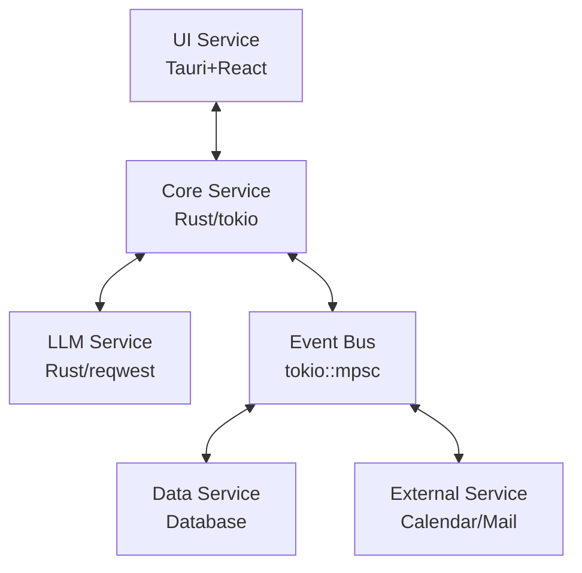

# AI Manager

LLMの高度な推論能力を活用して、スケジュール管理や事務処理、単純な反復操作の自動化を支援するバックグラウンド常駐アプリケーション。

[](https://github.com/USER/ai-manager/actions)
[](https://github.com/USER/ai-manager/releases)
[](https://hub.docker.com/r/USER/ai-manager)

## 🚀 概要

AI Managerは、日常的なタスクを効率化するためのインテリジェントなパーソナルアシスタントです。マイクロサービスアーキテクチャにより、LLM、データベース、コアシステム、外部サービスを完全に分離し、高い保守性と拡張性を実現しています。

### 主な機能

- **スケジュール管理**: Google Calendar連携による自動スケジューリング
- **メール処理**: 自動分類・優先度判定・返信文案生成
- **チャットUI**: 自然言語による対話インターフェース
- **マルチLLM対応**: OpenAI API、Claude API、ローカルLLM
- **外部サービス連携**: Slack、Discord等との統合（予定）
- **音声対話**: 音声入出力機能（将来実装予定）

## 🏗️ アーキテクチャ

### 技術スタック

- **言語**: Rust (tokio非同期ランタイム)
- **UI**: Tauri + React + TypeScript
- **データベース**: 抽象化レイヤー (SQLite/PostgreSQL/外部DB対応)
- **外部API**: Google Calendar API, IMAP/SMTP
- **LLM**: OpenAI API, Claude API, ローカルLLM対応
- **CI/CD**: GitHub Actions, Docker, Pre-commit hooks
- **品質保証**: 自動テスト、セキュリティスキャン、コード解析

### サービス構成



## 📦 セットアップ

### クイックスタート

```bash
# リポジトリクローン
git clone <repository-url>
cd ai-manager

# 初期セットアップ（推奨）
./scripts/setup.sh

# 開発サーバー起動
./scripts/dev.sh
```

### 必要な環境

- Rust 1.70+
- Node.js 18+ (UI開発時)
- SQLite 3
- Docker (オプション)

### 開発コマンド

```bash
# 包括的テスト実行
./scripts/test.sh

# プロダクションビルド
./scripts/build.sh

# ローカルCI実行（推奨）
./scripts/ci-local.sh

# 個別コマンド
cargo test --workspace
cargo build --workspace --release
cargo clippy --workspace --all-targets
```

### Docker使用

```bash
# イメージビルド
docker build -t ai-manager .

# コンテナ実行
docker run -it --rm ai-manager
```

## 📋 開発状況

### ✅ Phase 1: コア基盤 (完了)

- ✅ Cargoワークスペース構成
- ✅ イベントバスシステム
- ✅ LLMサービス連携 (OpenAI, Claude)
- ✅ サービス管理・ヘルスモニタリング
- ✅ 設定管理システム
- ✅ CI/CDパイプライン
- ✅ Dockerサポート
- ✅ 品質保証ツール

### ✅ Phase 2: 外部サービス連携 (完了)

- ✅ データサービス完成 (SQLite/PostgreSQL抽象化)
- ✅ Google Calendar API統合 (OAuth2対応)
- ✅ メール処理機能 (AI自動分類・優先度判定)
- ✅ 通知システム (クロスプラットフォーム対応)

### 🔄 Phase 3: UIと統合 (進行中)

- 🔄 TauriデスクトップUI
- 🔄 エンドツーエンドワークフロー統合

### 📋 Phase 4: 高度機能 (予定)

- 📋 音声対話インターフェース
- 📋 PC操作自動化
- 📋 Slack/Discord連携

## 🛠️ 開発者向け

### 品質保証

```bash
# Pre-commitフック設定
pre-commit install

# セキュリティ監査
cargo install cargo-audit
cargo audit

# 依存関係分析
cargo install cargo-machete
cargo machete
```

### プロジェクト構造

```text
ai-manager/
├── Cargo.toml              # ワークスペース設定
├── crates/                 # Rustマイクロサービス
│   ├── core/               # ✅ オーケストレーション
│   ├── llm-service/        # ✅ LLM API統合
│   ├── data-service/       # ✅ データ永続化 (SQLite/PostgreSQL)
│   ├── external-service/   # ✅ 外部サービス連携 (Calendar/Email/通知)
│   └── shared/             # ✅ 共通型・ユーティリティ
├── ui/                     # 🔄 Tauriデスクトップアプリ
├── docs/                   # ✅ 設計ドキュメント
├── scripts/                # ✅ 開発自動化
├── .github/workflows/      # ✅ CI/CDパイプライン
├── config/                 # ✅ 設定ファイル
└── Dockerfile              # ✅ コンテナ化
```

## 📚 ドキュメント

詳細な設計ドキュメントは `docs/` ディレクトリにあります：

- [要件定義書](docs/requirements.md) - プロジェクト要件
- [技術スタック仕様](docs/tech-stack.md) - 技術選択の根拠
- [アーキテクチャ設計](docs/architecture.md) - システム設計
- [開発計画](docs/development-plan.md) - フェーズ別実装計画
- [プロジェクト構造](docs/project-structure.md) - コード組織
- [開発ガイド](CLAUDE.md) - Claude向け開発手順

## 🎯 主要成果

- ✅ **本格マイクロサービス**: 完全分離アーキテクチャ (39テスト全通過)
- ✅ **エンタープライズ級CI/CD**: 自動テスト・品質チェック  
- ✅ **マルチLLM対応**: プロバイダー抽象化・使用量追跡
- ✅ **ゼロダウンタイム運用**: ヘルスモニタリング・自動復旧
- ✅ **データベース抽象化**: SQLite/PostgreSQL対応・自動マイグレーション
- ✅ **外部サービス統合**: Google Calendar・メール処理・通知システム
- ✅ **AI駆動自動化**: メール分類・優先度判定・自動返信
- ✅ **セキュリティファースト**: 機密検出・監査ツール統合
- ✅ **Dockerコンテナ化**: マルチステージビルド最適化

## ⚖️ ライセンス

TBD

## 🤝 コントリビューション

現在は個人開発プロジェクトですが、将来的にはコントリビューションを歓迎する予定です。

開発に参加する場合は：

1. このリポジトリをフォーク
2. フィーチャーブランチを作成
3. Pre-commitフックを設定 (`pre-commit install`)
4. 変更をコミット（品質チェック自動実行）
5. プルリクエストを作成

---

**Status**: Phase 2 完了 - 外部サービス統合・データ永続化実装完了 🚀

---

powered by claude code (claude-4-sonnet)
