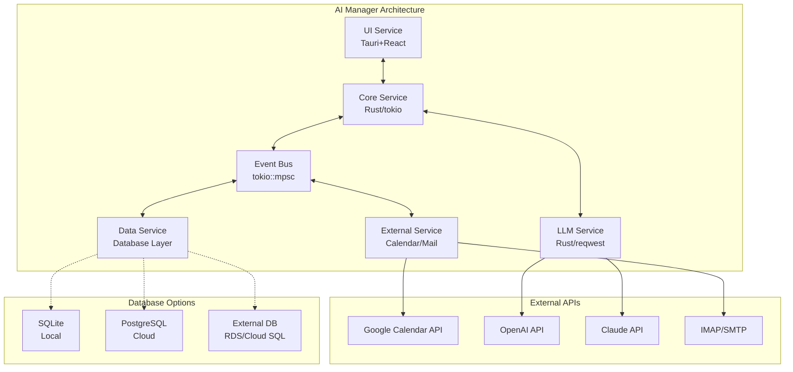

# AI Manager アーキテクチャ設計書

## 1. アーキテクチャ概要

### 1.1 マイクロサービス構成

#### ASCII図

```text
┌─────────────────┐    ┌─────────────────┐    ┌─────────────────┐
│   UI Service    │    │  Core Service   │    │  LLM Service    │
│   (Tauri+React) │◄──►│   (Rust/tokio)  │◄──►│   (Rust/reqwest)│
└─────────────────┘    └─────────────────┘    └─────────────────┘
                              │
                              ▼
┌─────────────────┐    ┌─────────────────┐    ┌─────────────────┐
│External Service │◄──►│  Event Bus      │◄──►│  Data Service   │
│(Calendar/Mail)  │    │  (tokio::mpsc)  │    │ (Database Layer)│
└─────────────────┘    └─────────────────┘    └─────────────────┘
```

#### Mermaid図



### 1.2 設計原則

- **完全分離**: 各サービスは独立して動作可能
- **非同期処理**: tokioベースの完全非同期実装
- **イベント駆動**: メッセージパッシングによる疎結合
- **フォルトトレラント**: サービス障害時の自動復旧

## 2. サービス間通信設計

### 2.1 メッセージ定義

```rust
#[derive(Debug, Clone, serde::Serialize, serde::Deserialize)]
pub enum ServiceMessage {
    // UI ↔ Core
    UserInput { 
        content: String, 
        timestamp: DateTime<Utc> 
    },
    SystemResponse { 
        content: String, 
        message_type: ResponseType 
    },
    
    // Core ↔ LLM
    LLMRequest { 
        prompt: String, 
        context: Vec<String> 
    },
    LLMResponse { 
        content: String, 
        usage: TokenUsage 
    },
    
    // Core ↔ External
    CalendarSync { 
        action: CalendarAction 
    },
    EmailProcess { 
        emails: Vec<EmailData> 
    },
    
    // Core ↔ Data
    StoreConversation { 
        user_id: String, 
        messages: Vec<Message> 
    },
    LoadUserProfile { 
        user_id: String 
    },
}
```

### 2.2 イベントバスアーキテクチャ

```rust
pub struct EventBus {
    // サービス間の双方向通信チャネル
    ui_tx: mpsc::Sender<ServiceMessage>,
    llm_tx: mpsc::Sender<ServiceMessage>,
    external_tx: mpsc::Sender<ServiceMessage>,
    data_tx: mpsc::Sender<ServiceMessage>,
    
    // ブロードキャスト用（通知など）
    broadcast_tx: broadcast::Sender<SystemEvent>,
}

impl EventBus {
    pub async fn route_message(&self, msg: ServiceMessage) -> Result<()> {
        match msg {
            ServiceMessage::UserInput { .. } => {
                self.core_tx.send(msg).await?;
            },
            ServiceMessage::LLMResponse { .. } => {
                self.ui_tx.send(msg).await?;
            },
            // 他のルーティングロジック
        }
        Ok(())
    }
}
```

## 3. サービス詳細設計

### 3.1 Core Service

**責務**: システム全体の調整とビジネスロジック

```rust
pub struct CoreService {
    event_bus: Arc<EventBus>,
    service_manager: ServiceManager,
    config: AppConfig,
}

// 主要機能
impl CoreService {
    async fn handle_user_input(&mut self, input: String) -> Result<()>;
    async fn coordinate_services(&mut self) -> Result<()>;
    async fn manage_conversations(&mut self) -> Result<()>;
}
```

### 3.2 LLM Service

**責務**: 各種LLMサービスとの通信

```rust
pub trait LLMProvider {
    async fn send_request(&self, prompt: String) -> Result<String>;
    async fn get_usage(&self) -> TokenUsage;
}

pub struct LLMService {
    providers: HashMap<String, Box<dyn LLMProvider>>,
    current_provider: String,
}
```

### 3.3 Data Service

**責務**: データの永続化と管理（データベース抽象化）

```rust
pub trait DatabaseConnection {
    async fn execute(&self, query: &str) -> Result<()>;
    async fn fetch_one<T>(&self, query: &str) -> Result<T>;
    async fn fetch_all<T>(&self, query: &str) -> Result<Vec<T>>;
}

pub struct DataService {
    connection: Box<dyn DatabaseConnection>,
    conversation_repo: ConversationRepository,
    profile_repo: UserProfileRepository,
}

// データモデル
#[derive(serde::Serialize, serde::Deserialize)]
pub struct Conversation {
    pub id: i64,
    pub user_id: String,
    pub messages: String, // JSON
    pub created_at: DateTime<Utc>,
}
```

### 3.4 External Service

**責務**: 外部サービスとの連携

```rust
pub struct ExternalService {
    calendar: GoogleCalendarClient,
    email: EmailClient,
    notifications: NotificationClient,
}

impl ExternalService {
    async fn sync_calendar(&mut self) -> Result<Vec<CalendarEvent>>;
    async fn process_emails(&mut self) -> Result<Vec<ProcessedEmail>>;
    async fn send_notification(&self, msg: String) -> Result<()>;
}
```

## 4. サービス独立性の保証

### 4.1 サービストレイト

```rust
pub trait Service {
    async fn start(&mut self, rx: mpsc::Receiver<ServiceMessage>) -> Result<()>;
    async fn handle_message(&mut self, msg: ServiceMessage) -> Result<()>;
    async fn health_check(&self) -> ServiceHealth;
    async fn shutdown(&mut self) -> Result<()>;
}
```

### 4.2 サービス管理

```rust
pub struct ServiceManager {
    services: HashMap<ServiceId, JoinHandle<()>>,
    health_monitor: HealthMonitor,
    restart_policy: RestartPolicy,
}

impl ServiceManager {
    pub async fn start_service(&mut self, service: Box<dyn Service>) -> Result<()>;
    pub async fn restart_service(&mut self, id: ServiceId) -> Result<()>;
    pub async fn monitor_health(&self) -> Result<()>;
}
```

## 5. エラーハンドリング・フォルトトレラント

### 5.1 エラー処理戦略

```rust
#[derive(thiserror::Error, Debug)]
pub enum SystemError {
    #[error("Service communication error: {0}")]
    ServiceCommunication(String),
    
    #[error("LLM API error: {0}")]
    LLMApi(String),
    
    #[error("Database error: {0}")]
    Database(#[from] sqlx::Error),
    
    #[error("External service error: {0}")]
    ExternalService(String),
}
```

### 5.2 復旧機能

- **自動再起動**: サービス障害時の自動復旧
- **サーキットブレーカー**: 外部サービス障害時の保護
- **グレースフルシャットダウン**: 安全な終了処理
- **データ整合性**: トランザクション管理

## 6. パフォーマンス最適化

### 6.1 非同期処理最適化

- **タスクプール**: 効率的なタスク管理
- **バックプレッシャー**: メモリ使用量制御
- **ストリーミング**: 大量データの効率的処理

### 6.2 リソース管理

- **接続プール**: データベース・HTTP接続の再利用
- **メモリ効率**: ゼロコピー・所有権移譲の活用
- **CPU効率**: 適切な並行度制御

## 7. セキュリティ設計

### 7.1 データ保護

- **暗号化**: 機密データの暗号化保存
- **認証情報管理**: OAuth2トークンの安全な管理
- **ログ保護**: 機密情報のログ出力防止

### 7.2 通信セキュリティ

- **TLS通信**: 外部API通信の暗号化
- **API認証**: 適切な認証ヘッダー管理
- **レート制限**: API使用量の制御
